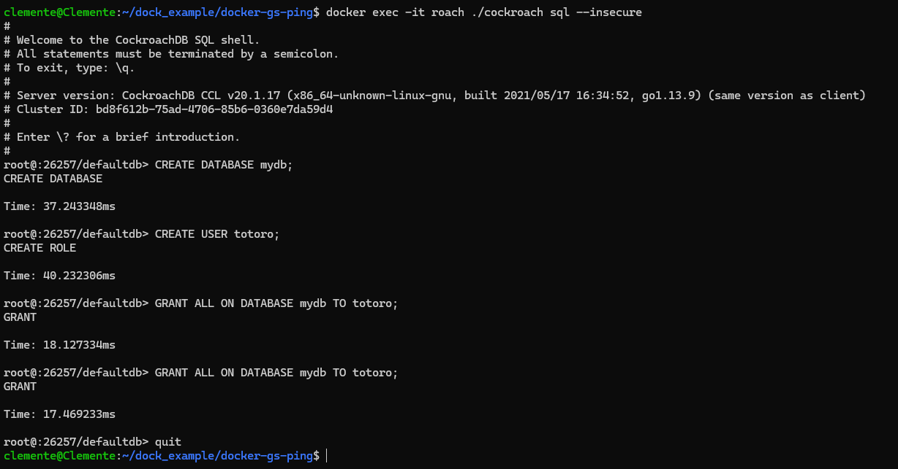

# <br/><br/>Tutorial Docker

## Requerimientos
- Tener instalado Go 1.16
- Tener instalado wsl2
- Tener instalado Docker

## <br/> Construir una imagen

Para construir una imagen necesitamos un proyecto. Clonamos un repositorio de un proyecto Go y probamos que funcione. 
```
git clone https://github.com/olliefr/docker-gs-ping
cd docker-gs-ping
go run main.go
```


\
Este proyecto contiene un ``Dockerfile``. Este archivo arma la imagen. En el proyecto que descargamos, lo que hace es descargar GoLang, armar una carpeta para copiar archivos llamado 'app', descargar y correr los módulos de Go, copiar los archivos Go al workplace 'app', correr la aplicación, exponer el puerto del container y luego correr. 

```Dockerfile
FROM golang:1.16-alpine
WORKDIR /app
COPY go.mod .
COPY go.sum .
RUN go mod download
COPY *.go ./
RUN go build -o /docker-gs-ping
EXPOSE 8080
CMD [ "/docker-gs-ping" ]
```

\
Para armar la imagen usando el Dockerfile, hay que correr el comando, donde `--tag` es para darle un nombre de tipo `string` a la imagen. 
```
docker build --tag docker-gs-ping
```


\
Al tener esta imagen creada, puedes correrlo con Docker con el comando
```
docker run docker-gs-ping
```
 


## <br /> Corriendo una Imagen como Contenedor

Se ejecuta el siguiente comando, `-d` siendo --detach (para que siga corriendo por detrás) y `-p` es --port (especificando que el puerto 8080 del container tiene que estar expuesto al puerto 8080 del computador).
Después vemos si efectivamente está corriendo. Después se para de ejecutar con el siguiente comando, y luego se revisa de nuevo que no este corriendo. 
```
docker run -d -p 8080:8080 docker-gs-ping
docker ps
docker stop -name-
docker ps
```
 

## <br/> Compartiendo Imágenes
Para compartir una imágen, lo primero que tenemos que hacer es un repositorio en Docker Hub. Esto se hace hiendo a ``Repositories``, haciendo click en ``Create repository``, poniendo nombre con visibilidad pública y apretar el botón `Create`. 

 
 
 

\
Después, hay que pushear la imagen. Para eso, te tienes que logear a tu cuenta Docker Hub,
```
docker login -u USERNAME
```
Con eso, darle la imagen un nuevo nombre
```
docker tag IMAGENAME USERNAME/IMAGEREPO
```
Y hacer el push final con 
```
docker push USERNAME/IMAGEREPO
```
 
 


## <br/> Almacenamiento, Bases de Datos, y Networking

Para este ejemplo, vamos a usar CockroachDB como base de datos. \
Lo primero que vamos hacer es crear un volumen (forma usada por contenedores de Docker para tener data persistente). Usamos `list` para ver que efectivamente creamos el volumen. 
```
docker volume create roach
docker volume list
```


\
Después, vamos a crear un puente de networking `mynet`, para la comunicación entre base de datos y aplicación. Usamos `list` para ver que efectivamente creamos este puente. 

 

\
Ahora podemos correr CockroachDB en un contenedor, y vincularlo con el volumen y red que creamos. 

```
docker run -d \
  --name roach \
  --hostname db \
  --network mynet \
  -p 26257:26257 \
  -p 8080:8080 \
  -v roach:/cockroach/cockroach-data \
  cockroachdb/cockroach:latest-v20.1 start-single-node \
  --insecure
```
 

\
Ahora que la engine de la base de datos está corriendo, tenemos que configurarla antes que la nuestra aplicación empiece a funcionar. 
Para esto vamos a realizar los siguientes pasos (mydb y totoro siendo nombres genéricos): 
1. Entrar a la shell de SQL del container donde está la engine de la base de datos
```powershell
docker exec -it roach ./cockroach sql --insecure
```
2. Crear una base de datos vacía
```sql
CREATE DATABASE mydb;
```
3. Registrar un nuevo usuario
```sql
CREATE USER totoro;
```
4. Darle al usuario los permisos necesarios
```sql
GRANT ALL ON DATABASE mydb TO totoro;
```
5. Salir de la shell. 
```sql
quit
```
 

## <br/> Development

Teniendo el volumen creado de la parte anterior, ahora lo podemos usar. Necesitamos conectar la aplicación a la base de datos con el tag `--network mynet`. Vamos a clonar un proyecto que use de las capacidades de esta base de datos. Le hacemos build y luego lo corremos
```powershell
git clone https://github.com/olliefr/docker-gs-ping-roach.git
cd docker-gs-ping-roach/
docker build --tag docker-gs-ping-roach .

docker run -it --rm -d \
  --network mynet \
  --name rest-server \
  -p 80:8080 \
  -e PGUSER=totoro \
  -e PGPASSWORD=myfriend \
  -e PGHOST=db \
  -e PGPORT=26257 \
  -e PGDATABASE=mydb \
  docker-gs-ping-roach
```

 

\
Puedes mandar mensajes con el comando 
 

## <br/> Docker Compose

En vez de estar escribiendo tantas líneas de código para solo empezar nuestra aplicación, podemos meter todo esto dentro de un archivo Docker Compose. 

Antes de hacer esto, creamos un archivo `.env` para almacenar información sensible. Para nuestro ejemplo necesitamos 
```shell-script
PGPASSWORD=whatever
```

El Docker File hace la misma función de correr los comandos en la línea de comandos con sus flags respectivos. Solo se necesita crear un archivo `docker-compose.yml` y ejecutar (**OJO**: esto no va a funcionar, por lo que miren el paso siguiente para arreglarlo), 
```powershell
docker-compose --build
```

El archivo necesita estos  datos,
```yml
version: '3.8'

services:
  docker-gs-ping-roach:
    depends_on: 
      - roach
    build:
      context: .
    container_name: rest-server
    hostname: rest-server
    networks:
      - mynet
    ports:
      - 80:8080
    environment:
      - PGUSER=${PGUSER:-totoro}
      - PGPASSWORD=${PGPASSWORD:?database password not set}
      - PGHOST=${PGHOST:-db}
      - PGPORT=${PGPORT:-26257}
      - PGDATABASE=${PGDATABASE:-mydb}
    deploy:
      restart_policy:
        condition: on-failure
  roach:
    image: cockroachdb/cockroach:latest-v20.1
    container_name: roach
    hostname: db
    networks:
      - mynet
    ports:
      - 26257:26257
      - 8080:8080
    volumes:
      - roach:/cockroach/cockroach-data
    command: start-single-node --insecure

volumes:
  roach:

networks:
  mynet:
    driver: bridge
``` 

\
Al correr `docker-compose up build`, la aplicación no se conectará a la base de datos. Es el mismo error de antes, por lo que solo tienen que realizar ese mismo paso para solucionarlo (en otro terminal meterse al engine de la base de datos, crear una base de datos, crear un usuario y luego darle los permisos).
\
Con eso, podemos correr la aplicación sin problema utilizando el siguiente comando (sin la necesidad de hacer build)
```
docker-compose up
```

 


## <br/> Testing
Un test de ejemplo se encuentra en el primer proyecto de ejemplo `docker-gs-ping`. Al hacer un build como se hizo anteriormente (para que la imagen de la aplicación esté al día), ahora podemos correr test que depende de él,
```
go test ./...
```
 

## <br/> Configuración de CI/CD

Para CI/CD, se hará mediante Docker GitHub Actions. 

Primero, es necesario configurar el repositorio de GitHub:
1. Tener en el repo el [Docker file template](https://github.com/dvdksn/clockbox/blob/main/Dockerfile).
2. En los Settings>Secrets>Actions crear `DOCKER_HUB_USERNAME` con tu Docker ID como valor.
3. Crear PAT para Docker Hub. y agregarlo como secreto al repositorio. 

\
Segundo, hay que configurar GitHub Actions:
1. En GitHub, en el tab de Actions, selecionar set up a worflow yourself
2. Agregar el siguiente código,
```yaml
name: ci

on:
  push:
    branches:
      - "main"

jobs:
  build:
    runs-on: ubuntu-latest
```
\
Tercero, modificar el YAML anterior para que contenga los pasos a ejecutar,
```yaml
name: ci

on:
  push:
    branches:
      - "main"

jobs:
  build:
    runs-on: ubuntu-latest
    steps:
      -
        name: Checkout
        uses: actions/checkout@v3
      -
        name: Login to Docker Hub
        uses: docker/login-action@v2
        with:
          username: ${{ secrets.DOCKER_HUB_USERNAME }}
          password: ${{ secrets.DOCKER_HUB_ACCESS_TOKEN }}
      -
        name: Set up Docker Buildx
        uses: docker/setup-buildx-action@v2
      -
        name: Build and push
        uses: docker/build-push-action@v3
        with:
          context: .
          file: ./Dockerfile
          push: true
          tags: ${{ secrets.DOCKER_HUB_USERNAME }}/clockbox:latest
```

\
Cuarto, ahora estás listo. Al hacer push en `main` el workflow empieza automáticamente. Puedes ir al tab Actions para ver el workflow. Cuando termine, puedes ir a tus [repositorios en Docker Hub](https://hub.docker.com/repositories) para ver que efectivamente está en Docker Hub.

## <br/> Deploy de tu App

Docker soporta hacer deploy en 
- Azure ACI: Se podrá usar comandos de Docker dentro de aplicaciones Azure Containter Instances cuando se crean aplicaciones cloud. 
- AWS ECS: Al deployar de esta forma, se podrá usar Docker Compose CLI para configurar un contexto AWS con solo un comando de Docker. Con esto, se puede cambiar de un contexto local a uno cloud de manera rápida. 
- Kubernetes: Docker Desktop incluye un servidor y cliente Kubernetes. Para utilizarlo tienes que habilitarlo en las preferencias del menú de Docker. 