# Guía Kubernetes

## 1. Crear un cluster Kubernetes

### 1.1 ¿Qué es un cluster?

Un cluster es un conjunto de máquinas que ejecutan Kubernetes y están conectadas entre sí para que puedan comunicarse y trabajar como unidad. Para ello se deben colocar las aplicaciones a ejecutar en contenedores y estos contenedores deben ser gestionados por un orquestador de contenedores como Kubernetes.

Consiste de dos tipos de recursos:
-  **Nodos** : Son las máquinas que ejecutan los contenedores.
-  **Máster** : Es la máquina que controla el cluster.

### 1.2 Creación de un cluster con Minikube

1.  Primero se debe instalar Minikube, para ello se debe descargar el instalador de la página oficial de Minikube y ejecutarlo:  [Instalador](https://minikube.sigs.k8s.io/docs/start/).

2.  Una vez instalado Minikube, se debe iniciar el cluster con el comando: `minikube start`. Así debería verse la consola: 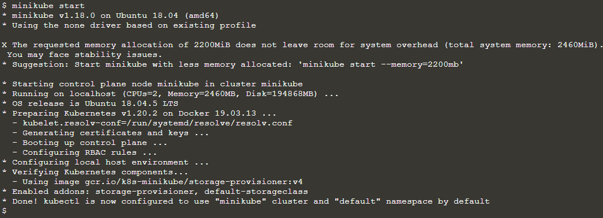

3.  Para interactuar con Kubernets se debe usar el comando `kubectl`. Se puede comprobar que se ha instalado correctamente con el comando `kubectl version`.

4.  Para ver la información del cluster se puede usar el comando `kubectl cluster-info`.

5.  Para ver los nodos del cluster se debe ejecutar el comando `kubectl get nodes`. Así debería verse la consola: 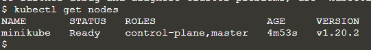 Se puede observar que hay un nodo en el cluster y que está en estado Ready.

## 2. Desplegar una app

### 2.1 Introducción
Para realizar un despligue, primero se debe crear un arhivo con la configuración de despliegue.

Cuando se realiza el despliegue, el controlador de despliegue se encarga de crear los pods y de mantenerlos en el estado deseado.

Para crear un despliegue, se puede usar `kubectl`, este utiliza la API de Kubernetes para interactuar con el cluster.

### 2.2 Creación de un despliegue

1.  El primer comando que se debe ejecutar es `kubectl create deployment <nombre_deployment> --image=<nombre_imagen>`. En este caso se usa como imágen `kubernetes-bootcamp:v1`. Así debería verse la consola: 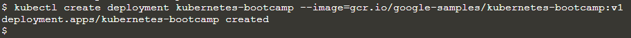

2.  Para ver los despliegues se debe ejecutar el comando `kubectl get deployments`. Así debería verse la consola:  Se puede observar que hay un despliegue llamado `kubernetes-bootcamp` y que está en estado `Available`, este está corriendo en un Docker container.

3.  Para poder acceder a la aplicación desplegada, se debe ejecutar el comando `kubectl proxy` en un nuevo terminal. Así debería verse la consola: 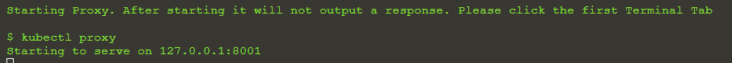

4.  Ahora se puede acceder a la aplicación desplegada con el comando `curl http://localhost:8001/version` en el navegador. Así debería verse la consola: 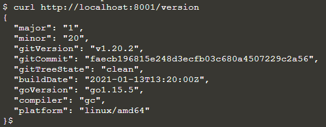

5.  Para acceder a los pods a través de la API, primero se deben almacenar sus nombres con el siguiente comando en ENV: `export POD_NAME=$(kubectl get pods -o go-template --template '{{range .items}}{{.metadata.name}}{{"\n"}}{{end}}')`. Así debería verse la consola: 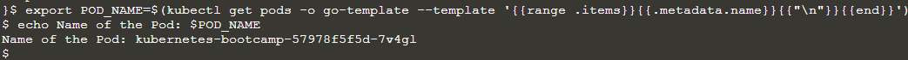

6.  Ahora se puede acceder a la aplicación desplegada con el comando `curl http://localhost:8001/api/v1/namespaces/default/pods/$POD_NAME/proxy/`.

## 3. Troubleshoot Kubernetes (get, describe, logs y exec)

### 3.1 Introducción

**¿Qué son los pods?**

Un pod es un grupo de uno o más contenedores que se ejecutan en un nodo. Los pods se utilizan para ejecutar aplicaciones en Kubernetes. Comparten un espacio de red y almacenamiento.

**¿Qué son los nodes?**

Un nodo es una máquina de trabajo en Kubernetes, previamente preparada para ejecutar aplicaciones. Un nodo puede ser una máquina virtual o física, dependiendo del tipo de cluster. Los pods se ejecutan en los nodos.

### 3.2 Troubleshoot

1.  Para ver los pods se debe ejecutar el comando `kubectl get pods`. Así debería verse la consola: 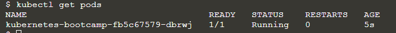 Se puede observar que hay un pod que está en estado `Running`.

2.  Para ver la información detallada de un pod se debe ejecutar el comando `kubectl describe pods`. Esta información incluye el estado del pod, los eventos que han ocurrido en el pod, los recursos que se han asignado al pod, etc.

3. Almaenar el nombre del pod en ENV: `export POD_NAME=$(kubectl get pods -o go-template --template '{{range .items}}{{.metadata.name}}{{"\n"}}{{end}}')`. Así debería verse la consola: 

4. Para ver los logs de un pod se debe ejecutar el comando `kubectl logs $POD_NAME`.
Así debería verse la consola: 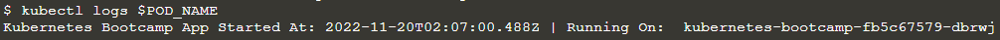

5.  Para ejecutar un comando en un pod se debe ejecutar el comando `kubectl exec -ti $POD_NAME <comando>`.

6.  Podemos iniciar una sesión interactiva con el comando `kubectl exec -ti $POD_NAME bash`. Para ejecutar comandos internamente en el container de nuestra aplicación.

## 4. Exponer una aplicación públicamente

### 4.1 Introducción

**¿Qué es un servicio?**

Un servicio es un objeto que define un conjunto de pods y una política para acceder a ellos. Los servicios permiten que los pods se comuniquen entre sí y con otros servicios externos.

**¿Qué es un label?**

Un label es un par clave-valor que se asigna a un objeto. Los labels permiten identificar objetos de manera que puedan ser seleccionados y agrupados.

### 4.2 Exponer una aplicación

1.  Para obtener la lista de servicios se debe ejecutar el comando `kubectl get services`. Así debería verse la consola: 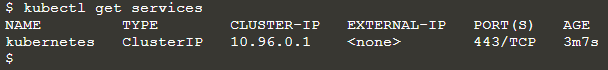 Se puede observar que hay un servicio llamado `kubernetes` y este se crea por defecto.

2.  Para crear un servicio se debe ejecutar el comando `kubectl expose deployment/kubernetes-bootcamp --type="NodePort" --port 8080`. Así debería verse la consola: 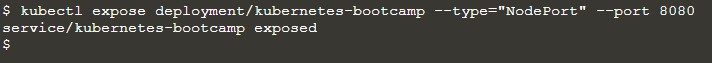 Ahora hay un servicio
de tipo NodePort llamado `kubernetes-bootcamp`, este servicio expone el puerto 8080 del pod.

3.  Ahora creamos una variable de entorno con el comando `export NODE_PORT=$(kubectl get services/kubernetes-bootcamp -o go-template='{{(index .spec.ports 0).nodePort}}')`. Así debería verse la consola: 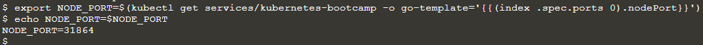

4.  Ahora podemos acceder a la aplicación desplegada con el comando `curl $(minikube ip):$NODE_PORT`. Así debería verse la consola: 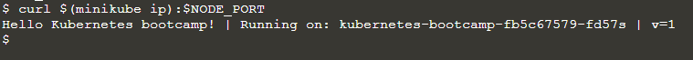

### 4.3 Labels de aplicación

1. Para obtener el label de nuestro despliegue, ejecutamos el comando `kubectl describe deployment`. Así debería verse la consola: 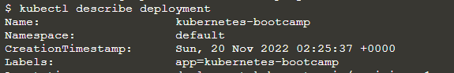 Se puede observar que el label de nuestro despliegue es `app=kubernetes-bootcamp`.

2.  Para obtener los pods que tienen el label `app=kubernetes-bootcamp` se debe ejecutar el comando `kubectl get pods -l app=kubernetes-bootcamp`.

3.  Se puede hacer lo mismo con los servicios, para obtener los servicios que tienen el label `app=kubernetes-bootcamp` se debe ejecutar el comando `kubectl get services -l app=kubernetes-bootcamp`.

4.  Guardemos el nombre del pod en una variable de entorno con el comando `export POD_NAME=$(kubectl get pods -o go-template --template '{{range .items}}{{.metadata.name}}{{"\n"}}{{end}}')`.

5. Para agregar un nuevo label a un pod se debe ejecutar el comando `kubectl label pod $POD_NAME app=v1`. Así debería verse la consola: 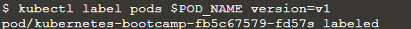

### Eliminar un servicio

1.  Para eliminar un servicio se debe ejecutar el comando `kubectl delete service -l app=kubernetes-bootcamp`. Se puede colocar otra label dependiendo del servicio que se desea borrar. Así debería verse la consola: 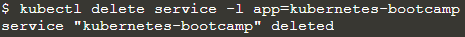

2.  Podemos confirmar que el servicio se ha eliminado con el comando `kubectl get services`. También se puede ver que `curl $(minikube ip):$NODE_PORT` ya no funciona.

3.  También se puede comprobar que la aplicación sigue corriendo con el comando `kubectl exec -ti $POD_NAME -- curl localhost:8080`. Se puede observar que la aplicación sigue corriendo, ya que el servicio se eliminó pero no el despliegue.

## 5. Escalar una aplicación

### 5.1 Introducción

En los pasos anteriores se ha visto como desplegar una aplicación y exponerla públicamente. Ahora se verá como escalar una aplicación. Esto es necesario ya que en un ambiente de producción se necesitan más pods para soportar el tráfico de la aplicación.

**¿Qué es un replicaset?**

Un replicaset es un objeto que define un conjunto de pods y una política para mantener el número de pods en el conjunto. Los replicaset se utilizan para escalar una aplicación.

### 5.2 Escalar una aplicación

1.  Para ver el replicaset de nuestro despliegue se debe ejecutar el comando `kubectl get replicasets`. Así debería verse la consola: 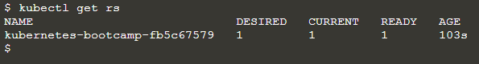 Se puede observar que el replicaset y que está ready. Desired es el número de pods que se desean tener y Current es el número de pods que se tienen actualmente.

2.  Vamos a escalar la aplicación a 4 pods con el comando `kubectl scale deployments/kubernetes-bootcamp --replicas=4`. Así debería verse la consola: 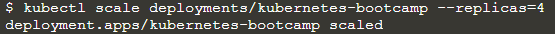

3.  Veamos el número de pods que tenemos con el comando `kubectl get pods -o wide`. Así debería verse la consola: 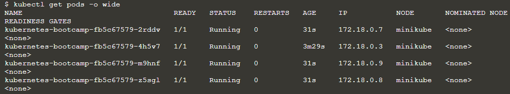 Se puede observar que hay 4 pods.

### 5.3 Load Balancing

1.  Creamos una variable de entorno con el comando `export NODE_PORT=$(kubectl get services/kubernetes-bootcamp -o go-template='{{(index .spec.ports 0).nodePort}}')`.

2.  Ahora podemos acceder a la aplicación desplegada con el comando `curl $(minikube ip):$NODE_PORT`. Cada vez que se ejecuta, se obtiene un pod diferente. Así debería verse la consola: 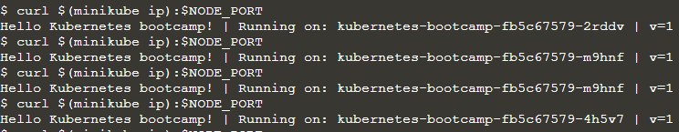

### 5.4 Scale Down

1.  Para escalar la aplicación a 2 pods se debe ejecutar el comando `kubectl scale deployments/kubernetes-bootcamp --replicas=2`.

2.  Corriendo el comando `kubectl get pods -o wide` se puede observar que hay 2 pods `Running`. Así debería verse la consola: 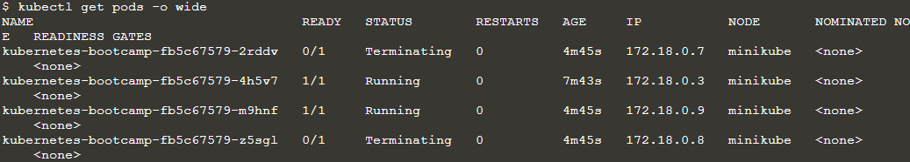

