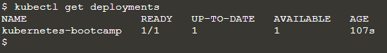

# Guía Kubernetes

## 1. Crear un cluster Kubernetes

### 1.1 ¿Qué es un cluster?

Un cluster es un conjunto de máquinas que ejecutan Kubernetes y están conectadas entre sí para que puedan comunicarse y trabajar como unidad. Para ello se deben colocar las aplicaciones a ejecutar en contenedores y estos contenedores deben ser gestionados por un orquestador de contenedores como Kubernetes.

Consiste de dos tipos de recursos:
-  **Nodos** : Son las máquinas que ejecutan los contenedores.
-  **Máster** : Es la máquina que controla el cluster.

### 1.2 Creación de un cluster con Minikube

1.  Primero se debe instalar Minikube, para ello se debe descargar el instalador de la página oficial de Minikube y ejecutarlo:  [Instalador](https://minikube.sigs.k8s.io/docs/start/).

2.  Una vez instalado Minikube, se debe iniciar el cluster con el comando: `minikube start`. Así debería verse la consola: 

3.  Para interactuar con Kubernets se debe usar el comando `kubectl`. Se puede comprobar que se ha instalado correctamente con el comando `kubectl version`.

4.  Para ver la información del cluster se puede usar el comando `kubectl cluster-info`.

5.  Para ver los nodos del cluster se debe ejecutar el comando `kubectl get nodes`. Así debería verse la consola:  Se puede observar que hay un nodo en el cluster y que está en estado Ready.

## 2. Desplegar una app

### 2.1 Introducción
Para realizar un despligue, primero se debe crear un arhivo con la configuración de despliegue.

Cuando se realiza el despliegue, el controlador de despliegue se encarga de crear los pods y de mantenerlos en el estado deseado.

Para crear un despliegue, se puede usar `kubectl`, este utiliza la API de Kubernetes para interactuar con el cluster.

### 2.2 Creación de un despliegue

1.  El primer comando que se debe ejecutar es `kubectl create deployment <nombre_deployment> --image=<nombre_imagen>`. En este caso se usa como imágen `kubernetes-bootcamp:v1`. Así debería verse la consola: 

2.  Para ver los despliegues se debe ejecutar el comando `kubectl get deployments`. Así debería verse la consola:  Se puede observar que hay un despliegue llamado `kubernetes-bootcamp` y que está en estado `Available`, este está corriendo en un Docker container.

3.  Para poder acceder a la aplicación desplegada, se debe ejecutar el comando `kubectl proxy` en un nuevo terminal. Así debería verse la consola: 

4.  Ahora se puede acceder a la aplicación desplegada con el comando `curl http://localhost:8001/version` en el navegador. Así debería verse la consola: 

5.  Para acceder a los pods a través de la API, primero se deben almacenar sus nombres con el siguiente comando en ENV: `export POD_NAME=$(kubectl get pods -o go-template --template '{{range .items}}{{.metadata.name}}{{"\n"}}{{end}}')`. Así debería verse la consola: 

6.  Ahora se puede acceder a la aplicación desplegada con el comando `curl http://localhost:8001/api/v1/namespaces/default/pods/$POD_NAME/proxy/`.

## Troubleshoot Kubernetes (get, describe, logs y exec)

### 3.1 Introducción

**¿Qué son los pods?**

Un pod es un grupo de uno o más contenedores que se ejecutan en un nodo. Los pods se utilizan para ejecutar aplicaciones en Kubernetes. Comparten un espacio de red y almacenamiento.

**¿Qué son los nodes?**

Un nodo es una máquina de trabajo en Kubernetes, previamente preparada para ejecutar aplicaciones. Un nodo puede ser una máquina virtual o física, dependiendo del tipo de cluster. Los pods se ejecutan en los nodos.

### 3.2 Troubleshoot

1.  Para ver los pods se debe ejecutar el comando `kubectl get pods`. Así debería verse la consola:  Se puede observar que hay un pod que está en estado `Running`.

2.  Para ver la información detallada de un pod se debe ejecutar el comando `kubectl describe pods`. Esta información incluye el estado del pod, los eventos que han ocurrido en el pod, los recursos que se han asignado al pod, etc.

3. Almaenar el nombre del pod en ENV: `export POD_NAME=$(kubectl get pods -o go-template --template '{{range .items}}{{.metadata.name}}{{"\n"}}{{end}}')`. Así debería verse la consola: 

4. Para ver los logs de un pod se debe ejecutar el comando `kubectl logs $POD_NAME`.
Así debería verse la consola: 

5.  Para ejecutar un comando en un pod se debe ejecutar el comando `kubectl exec -ti $POD_NAME <comando>`.

6.  Podemos iniciar una sesión interactiva con el comando `kubectl exec -ti $POD_NAME bash`. Para ejecutar comandos internamente en el container de nuestra aplicación.
